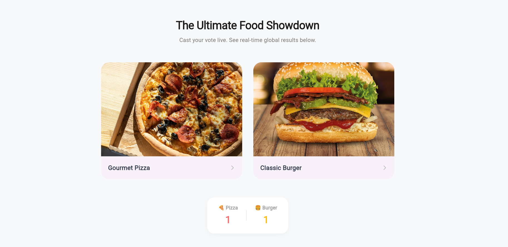

# 🍔 The Ultimate Food Showdown (Real-Time Voting Poll)

A polished, real-time web application built to demonstrate live data streaming over WebSockets. 
Users can cast their votes for their favorite food item, and global scores update instantly across all connected devices without requiring a page refresh.



---

## 🚀 Key Features
* **Real-Time Data Streams:** Powered by Socket.io to push instantaneous global score tallies to all users simultaneously.
* **Premium Web UI:** Fully customized Flutter layout featuring structured material cards, responsive image aspect ratios, subtle interactive ink splashes, and depth overlays.
* **Single-Vote Restriction Set:** Backend security validation utilizing ephemeral socket identifiers to prevent automated spamming or double-voting manipulation.
* **Cross-Origin Configuration:** Integrated CORS middleware handling on Node.js to allow seamless browser-to-server communication environments.

---

## 🛠️ Architecture & Tech Stack

* **Frontend Client:** Flutter Web (Dart)
    * State Management: `StatefulWidget` Lifecycle
    * Communication Client: `socket_io_client`
* **Backend Server:** Node.js (JavaScript)
    * Framework: Express.js
    * Real-Time Communication Layer: Socket.io Engine

---

## 📦 Local Project Setup & Installation

### 1. Prerequisites
Ensure you have the [Flutter SDK](https://docs.flutter.dev/get-started/install) and [Node.js runtime environment](https://nodejs.org/) configured locally on your operating machine.

### 2. Running the Backend Server
Navigate to the server root directory and initialize the local runtime environment:
```bash
cd backend
npm install
node server.js